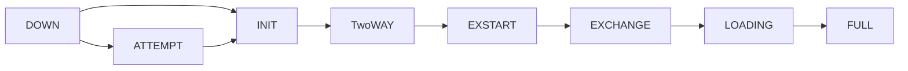
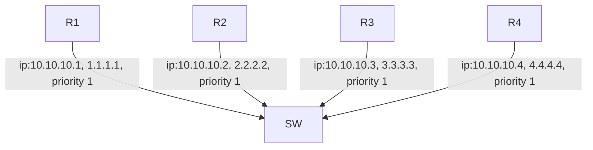

# Open Shortest Path First (OSPF)
**OSPF TABLES**
- Neighbor Table
- Topology Table
  - Link State Database (LSDB)
  - Link State Advertisemet (LSA)
- Routing Table

**OSPF PACKETS**
> *Hello*
>
> *Database Descriptor(DBD)*
>
> *Link State Request(LSR)*
>
> *Link State UPdate(LSU)*
>
> *LsACK*

**Neighbor Table**
- Directly connected OSPF routers
- state of Adjacency( Full,two way,DR)
- *show ip ospf neighbor*

**Topoly Table**
- Everything OSPF Know About
- Link State Database(LSDB)
  - Each entry in LSDB is known as: link state advertisement(LSA)
  - *show ip ospf database*

**Routing Tables**
- Routers Routing Table (not Solely a function of OSPF)
- OSPF will contribute its best routes to routing tables.

## OSPF PACKETS
**Hello** 
  - Perodically sent to **224.0.0.5** (Multicast address for all Ospf routers)
  - Discover other OSPF routers.
  - Includes info about sending router
  - Determines whether adjacency will form.

**Database Descriptor(DBD)**
  - Summary of LSA's in each routers LSDB.
  - Avoids sending full LSDB for each Neighbor.

**Link State Request(LSR)**
  - Sent to request full LSA's.

**Link State Update(LSU)**
  - Includes request LSA's
  - Also Sent For newly learned Networks.

**Link State Acknowledgement (LsACK)**
  - Sent to confirm reception of LSU.


## OSPF AREAS
- OSPF routers maintain identical LSDBs ( Changes anywhere propagated everywhere)
- Networks can be Segregated using Areas.
    - limits propagation to confined sections.
- Area Design Create a 0-tier hierarchy
    - Area 0: Top of Hierarchy , **BACKBONE AREA**
    - Area# : All other Areas: **1 to 4,294,967,295**
- Traffic between areas must traverse **Area 0**
    - Assures loop free area topologies
    - Hub and Spoke Desing.
 
      
## OSPF Types Of Routers
- Internal Routers
  - All interfaces in Single Area.

- Backbone Routers.
    - At least one interface in Area 0
  
- ABR-Area Border Routers.
    - Interfcaes in Area 0 and another Area.
    - Maintain a LSDB for each Area.
    - Summarize LSA's between Area.

- ASBR:Autonomus System Border Routers.
    -Redistributing foregin routes into OSPF.

|---------------------------------------------------------------------------------------------------------------------------------------------------------|

## HELLO PACKETS:
- Discover OSPF neighbors.
- Sent periodically to 224.0.0.5
  - Typically every 10 Seconds.
- Some Network don't support multicast
  - Router's peer ip must be maunually configured.
  - Hello packets sent unicat (tyically every 30 seconds)
- Content of hello determines if router will become neighbor

| Hello Packtes    | Descriptio |
|-------------------|------------|
| **Router ID**     | Identity of each routers (32bit)|
| **Hello Interval**| Frequency of periodic hello's |
| **Dead INterval** | Duration to remember Neighbor (Typically 4*Hello interval) |rea
| **Neighbor**      | Neighbor router's ID's seen on link. *validates two way reachability* |
| **Area ID**       | OSPF area interface belongs to  |
| **Authentication data** | Password restricated peering** |
| **Network mask**   |  Subnet mask for link |
| **Area Type**    | Normal,stub,NSSA  |
| **DR**            | IP address of DR |
| **BDR**          | IP address of BDR |
| **Priority**    | Influences DR/BDR election |


## AREA TYPE
- Normal Area : Default Area Type
- STUB AREA :
    - No redistributed routes
    - Replaced with default routes.
- NSSA: Not So Stubby Area
    - no redistrbution , except from local area.
    - optionall replaced with default routes.

## OSPF ADJACENCY



- DOWN
  - Initial state when ospf first configured
      - Technically , a non-state
  -Sending perodic Hellos to 224.0.0.5
      - Initally *Neighbor* field is *Empty*.

- INIT:
    - Received a hello packets.
    - Outbound hellos now include peer router ID.
 
- 2-Way:
    - Router see itself in Neighbor hello.
    - Router decide if adjacency will proceed.
 
- ExSTART:
    - Master/slave election.
    - Governs reliable DBD exchange.
    - Higher Router-id become master.
 
- ExChange:
    - Master/slave election is complete.
    - Slaves sends confirming DBD.
    - Peers exchange LSDB Summaries.
 
- Loading:
    - peer Know LSA's in Neighbor LSDB.
    - peer begin requesting full LSA's
    - LSR,LSU,LsACK.
 
  -FULL:
    - LSDB'S are syncronized.
    - Adjacency Complete.


## DR and BDR ELECTION:
- Elected using interface priority number.
    - Range [0-255]
    - Default 1
    - Highest router-id breaks ties.
 

- R1 initial hello packets.
    - Router id: 1.1.1.1
    - priority: 1
    - DR ip: 0.0.0.0
    - BDR ip : 0.0.0.0
- Checking if DR already exists.
- Duration: wait timer (same as dead interval 40sec)
- if no other DR found , R1 elects itself DR.
    - router id 1.1.1.1
    - priority 1
    - DR: 10.10.10.1
    - BDR: 0.0.0.0
 
-R2 Initiat Hello packets
  - Router ID: 2.2.2.2 
  - Priority : 1
  - DR: 0.0.0.0
  - BDR: 0.0.0.0
- Checking if DR already exists.
- Receives Hello packet from R1.
  - R2 has same priority , but better router id.
  - Does not preemot current DR.
- R2 Elects itself BDR.
  - router id: 2.2.2.2
  - priority: 1
  - DR: 10.10.10.1
  - BDR: 10.10.10.2
 
- R1 hello packets.
    - router id: 1.1.1.1
    - priority: 1
    - DR: 10.10.10.1
    - BDR: 10.10.10.2
 
- R3/R4 see DR/BDR already elected. Become something other than DR i.e DROTHER.
- Each router syncs LSDB with DR/BDR.
- DR/BDR requires full adjacency.
- No LSDB sync with other DROTHERS.
    - ***DR/BDR status and priority is per interfaces , not peer router***
- ***R1 is DR because it was enabled first***
- ***Priority can be influence for DR election***
    - ***0-255-default:1-Higher is better***
    - ***Ties broken by router id***
    - ***0 never become DR/BDR, interface is always DROTHER***
- ***Command: ip ospf priority [0-255]***

- How are routing updates propagated?
    - 224.0.0.5- All OSPF routers.
    - 224.0.0.6- Only DR/BDR
 
- When DR has routing updates:
    - DR sends LSU to 224.0.0.5 ( to all routers)
    - BDR send LsACK 224.0.0.5 ( to all routers)
    - DROTHER's send LsACK to 224.0.0.6 ( only to DR/BDR)
      
- When BDR has routing updates:
    - BDR sends LSU to 224.0.0.5
    - DR sends LsACK to 224.0.0.5
    - DROTHER's sends LsACk to 224.0.0.6
 
- When DROTHER's has routing updates:
    - DROTHERS sends LSU to 224.0.0.6
    - DR sends LSU to 224.0.0.5
    - BDR send LsACK to 224.0.0.5
    - Remaining DROTHERs send LsACk to 224.0.0.6.


 ## OSPF COST CALCULATION:

**COST= Refernce Bandwith / Interface Bandwidth  (Default: 100MPBS)**


## OSPF NETWORK TYPE

```mermaid
graph LR;
R1 --> | PointToPoint |  R2;
```
