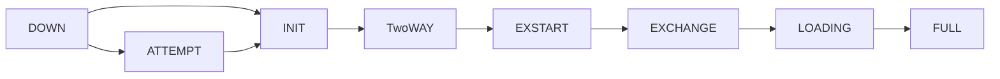

# OSPF
**OSPF TABLES**
- Neighbor Table
- Topology Table
  - Link State Database (LSDB)
  - Link State Advertisemet (LSA)
- Routing Table

**OSPF PACKETS**
> *Hello*
>
> *Database Descriptor(DBD)*
>
> *Link State Request(LSR)*
>
> *Link State UPdate(LSU)*
>
> *LsACK*

**Neighbor Table**
- Directly connected OSPF routers
- state of Adjacency( Full,two way,DR)
- *show ip ospf neighbor*

**Topoly Table**
- Everything OSPF Know About
- Link State Database(LSDB)
  - Each entry in LSDB is known as: link state advertisement(LSA)
  - *show ip ospf database*

**Routing Tables**
- Routers Routing Table (not Solely a function of OSPF)
- OSPF will contribute its best routes to routing tables.

## OSPF PACKETS
**Hello** 
  - Perodically sent to **224.0.0.5** (Multicast address for all Ospf routers)
  - Discover other OSPF routers.
  - Includes info about sending router
  - Determines whether adjacency will form.

**Database Descriptor(DBD)**
  - Summary of LSA's in each routers LSDB.
  - Avoids sending full LSDB for each Neighbor.

**Link State Request(LSR)**
  - Sent to request full LSA's.

**Link State Update(LSU)**
  - Includes request LSA's
  - Also Sent For newly learned Networks.

**Link State Acknowledgement (LsACK)**
  - Sent to confirm reception of LSU.

## OSPF AREAS
- OSPF routers maintain identical LSDBs ( Changes anywhere propagated everywhere)
- Networks can be Segregated using Areas.
    - limits propagation to confined sections.
- Area Design Create a 0-tier hierarchy
    - Area 0: Top of Hierarchy , **BACKBONE AREA**
    - Area# : All other Areas: **1 to 4,294,967,295**
- Traffic between areas must traverse **Area 0**
    - Assures loop free area topologies
    - Hub and Spoke Desing.
 
      
## OSPF Types Of Routers
- Internal Routers
  - All interfaces in Single Area.

- Backbone Routers.
    - At least one interface in Area 0
  
- ABR-Area Border Routers.
    - Interfcaes in Area 0 and another Area.
    - Maintain a LSDB for each Area.
    - Summarize LSA's between Area.

- ASBR:Autonomus System Border Routers.
    -Redistributing foregin routes into OSPF.

|---------------------------------------------------------------------------------------------------------------------------------------------------------|

## HELLO PACKETS:
- Discover OSPF neighbors.
- Sent periodically to 224.0.0.5
  - Typically every 10 Seconds.
- Some Network don't support multicast
  - Router's peer ip must be maunually configured.
  - Hello packets sent unicat (tyically every 30 seconds)
- Content of hello determines if router will become neighbor

| Hello Packtes    | Descriptio |
|-------------------|------------|
| **Router ID**     | Identity of each routers (32bit)|
| **Hello Interval**| Frequency of periodic hello's |
| **Dead INterval** | Duration to remember Neighbor (Typically 4*Hello interval) |rea
| **Neighbor**      | Neighbor router's ID's seen on link. *validates two way reachability* |
| **Area ID**       | OSPF area interface belongs to  |
| **Authentication data** | Password restricated peering** |
| **Network mask**   |  Subnet mask for link |
| **Area Type**    | Normal,stub,NSSA  |
| **DR**            | IP address of DR |
| **BDR**          | IP address of BDR |
| **Priority**    | Influences DR/BDR election |

## AREA TYPE
- Normal Area : Default Area Type
- STUB AREA :
    - No redistributed routes
    - Replaced with default routes.
- NSSA: Not So Stubby Area
    - no redistrbution , except from local area.
    - optionall replaced with default routes.

## OSPF ADJACENCY

- DOWN
  - Initial state when ospf first configured
      - Technically , a non-state
  -Sending perodic Hellos to 224.0.0.5
      - Initally *Neighbor* field is *Empty*.

- INIT:
    - Received a hello packets.
    - Outbound hellos now include peer router ID.
 
- 2-Way:
    - Router see itself in Neighbor hello.
    - Router decide if adjacency will proceed.
 
- ExSTART:
    - Master/slave election.
    - Governs reliable DBD exchange.
    - Higher Router-id become master.
 
- ExChange:
    - Master/slave election is complete.
    - Slaves sends confirming DBD.
    - Peers exchange LSDB Summaries.
 
- Loading:
    - peer Know LSA's in Neighbor LSDB.
    - peer begin requesting full LSA's
    - LSR,LSU,LsACK.
 
  -FULL:
    - LSDB'S are syncronized.
    - Adjacency Complete.

     
